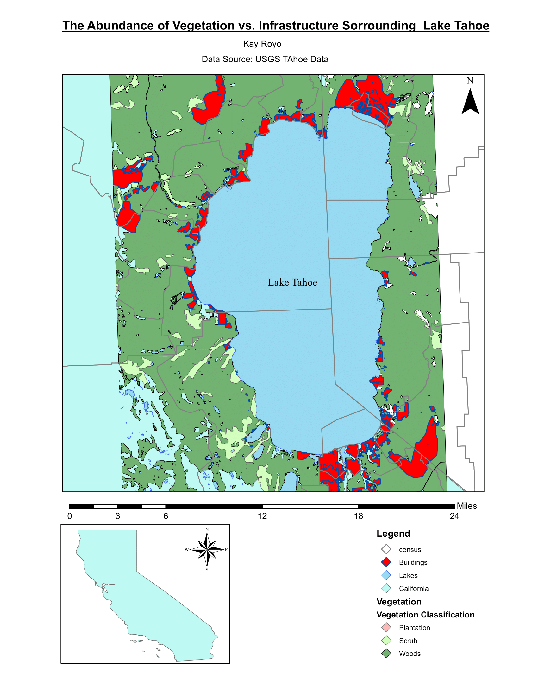

# Lake Tahoe

### Introduction: 
This map visualizes the GIS data gathered from https://tahoe.usgs.gov/data.html the associated metadata: Hypsography, Vegetation, Roads, Lakes, Rivers, Buildings, Docks and Lines, and Census. 
